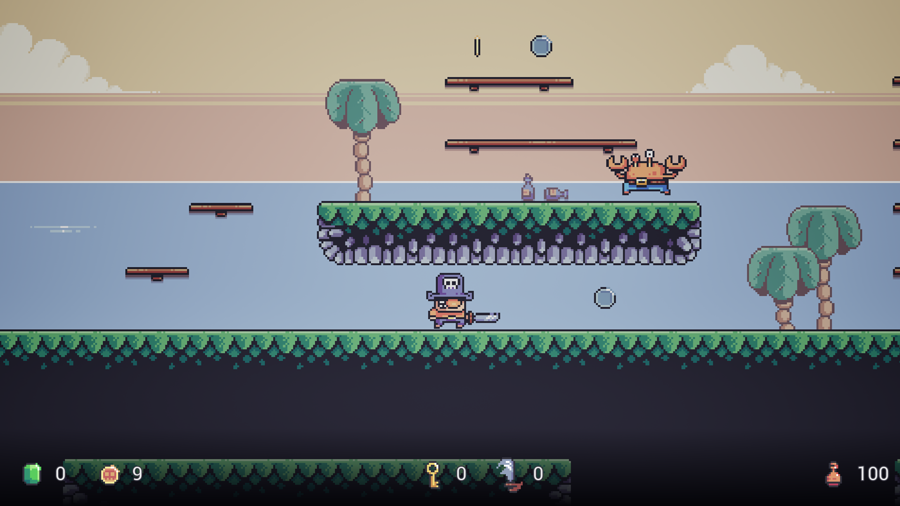

# CrustyPirate

This game initially was a project created by me during a course on the gamedev.tv platform. It's a simple, pixelart, platform game with just one enemy, very simple mechanics and even more simple UI. Assets have been included in the course. My goal was to make this game more professional, fun and complete. The original asset pack also includes other enemies, more tilesets, more animations, and UI.

Changes vs the initial game:

 - fixed z-fighting,
 - improved UI (although without pixelart UI assets included in the asset pack),
 - added background music,
 - added another tileset - Palm Tree Island,
 - improved AI (enemies patrol their platforms now, they start chasing the player if they spot the player or get hit by a sword, they lose interest if the player is too far for longer, and they follow the player even if the player is on another platform above or below),
 - added animations for jumping and falling to enemies,
 - added dust effects and explosions,
 - added dialogues to Captain and enemies,
 - added throwing swords to Captain,
 - added more sounds, more levels, and more enemies,
 - added cannons that can damage the player, enemies and destructibles,
 - added more collectibles (coins, more diamonds, chest key, swords),
 - added destructibles (barrels and boxes) and interactables (chest, flag),
 - destroyed destructibles, opened chests and defeated enemies now drop loot,
 - added platforms that can be jumped on from below,
 - added support for gamepad.

Pixelart assets: Treasure Hunters by Pixel Frog (https://pixelfrog-assets.itch.io/treasure-hunters?download)

Background music: Splash.mp3 by mickleness (https://freesound.org/s/316975/)
